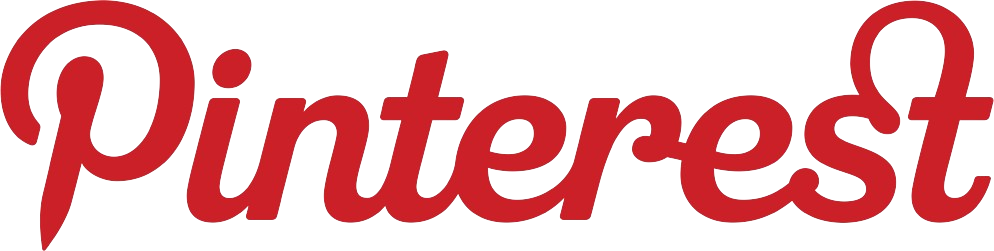
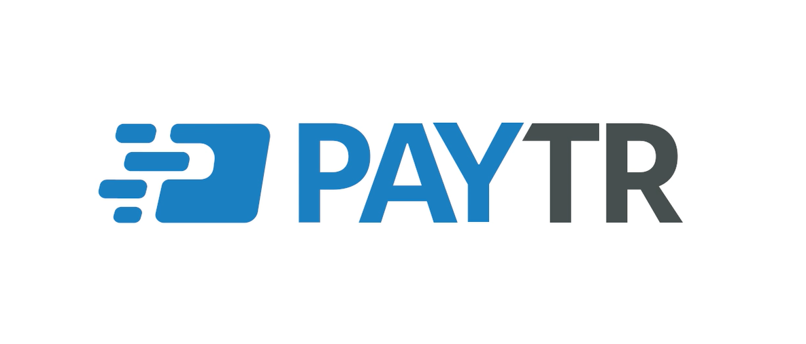

# Pinterest-Scraper

*Web Scraper Application for Pinterest, Made Using TypeScript-Based Selenium Web Driver, Allows You to Extract a Specified or Unlimited Amount of Data via the Pinterest URL You Specify.*

# Example


# Installation
* **1 Download requirements**
```shell
git clone https://github.com/Bes-js/Pinterest-Scraper
cd Pinterest-Scraper
npm install
```

* **2 Download ChromeDriver Or Google Chrome**

[ChromeDriver](https://chromedriver.chromium.org/downloads) via Driver, [Chrome Browser](https://www.google.com/chrome/) You can also install Chrome Browser from here, skip this step if it is already available.

# Usage

Example .env File
```js
websiteURL=https://pinterest.com/search/pins/?q=anime&rs=typed /* Pinterest URL to Scrape */
email=test@gmail.com /* Pinterest Email */
password=test123 /* Pinterest Password */
scrollCount=1 /* Page Scrool Count */
```
#
Console to compile and run with JavaScript;
```shell
npm run build:start
```
#
Or to the Console to Run Directly with ts-node;
```shell
npm run start
```

# Donation & Support
<a href="https://www.buymeacoffee.com/beykant" target="_blank">

</a>
<br>
<a href="https://www.paytr.com/link/2qh0pLB?lang=en" target="_blank">

</a>

[](https://discord.gg/luppux)

